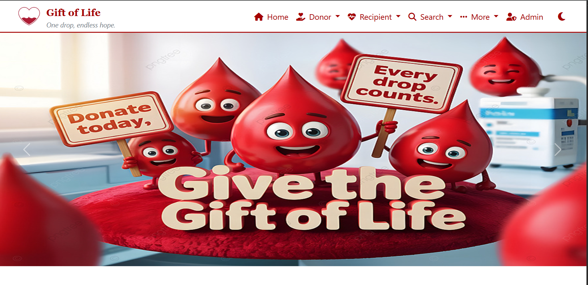
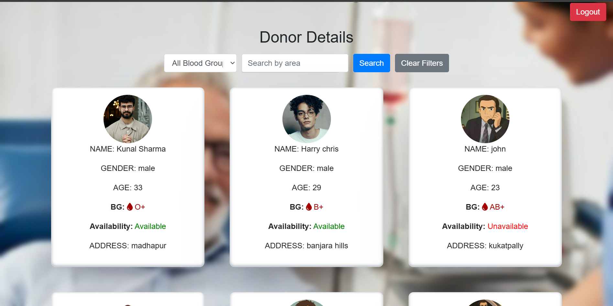
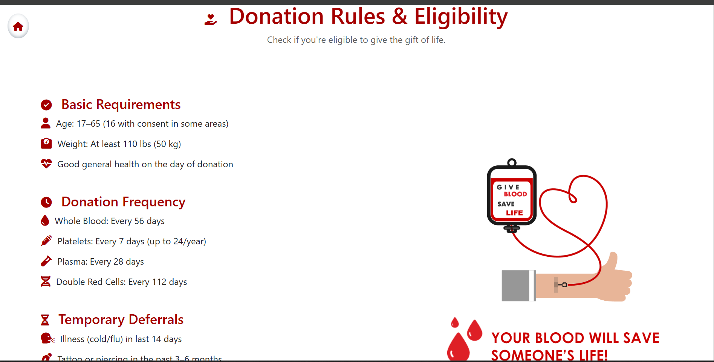

<h1 align="center">🩸 Blood Donation Web Portal 🩸</h1>
<p align="center">
Connecting donors with needers — Responsive Web App with Firebase & Bootstrap
</p>

<h2>📛 Badges</h2>
<p>
  
  
  
  
  
  
</p>

<h2>🚀 Overview</h2>

This project is a fully responsive blood donation portal that allows donors to register their details and needers to search for donors by area/location.  
All user data and donor details are handled using **Firebase Authentication & Firestore**, while donor images are stored securely via **Cloudinary**.

The project is built using pure frontend + cloud services, making it fast, scalable, and easy to deploy.

<h2>🧠 Why I Built This Project (Recruiter-Friendly)</h2>

I created this project to solve a real-world problem:  
People often struggle to find blood donors quickly during medical emergencies.

**My goals were to:**

- Build a practical, meaningful project that helps real users
- Learn and apply Firebase Authentication & Firestore database
- Use Cloudinary for real production-style image handling
- Implement responsive UI using Bootstrap
- Strengthen my JavaScript fundamentals, form validation & user flows
- Design a full end-to-end system without a traditional backend, using cloud services only

This showcases my skills in building functional, scalable, cloud-connected applications.

<h2>🛠️ Tech Stack</h2>

**⭐ Frontend**

- HTML5
- CSS3
- Bootstrap 5
- JavaScript (Vanilla)

**⭐ Backend / Cloud Services**

- Firebase Authentication — user sign-up/login
- Firebase Firestore — donor details storage
- Cloudinary — donor image uploads & optimization

**⭐ Architecture**

- Fully frontend-based application leveraging cloud services (Firebase + Cloudinary) — no traditional server required.

<h2>✨ Features</h2>

**👤 User System**

- Donor sign-up/login
- Needer sign-up/login
- Firebase-based authentication

**🩸 Donor Module**

- Add donor details
- Upload donor photo to Cloudinary
- Save and retrieve donor info from Firestore
- Blood group filters — search donors by blood type
- Availability status — donors can mark themselves as available/unavailable

**🔍 Needer / Search Module**

- Search donors based on area/location
- View donor details & photo
- Clean, responsive listing page

**🔐 Admin Tools**

- Admin login
- CRUD operations for donor entries

**📱 Responsiveness**

- Fully responsive via Bootstrap 5

<h2>📁 Project Structure</h2>
JS_Project/
│── index.html
│── index.css
│── index.js
│── donorSignUp.html
│── donorLogin.html
│── neederSignUp.html
│── neederSignIn.html
│── adminLoginBS.html
│── adminCRUD.html
│── gallery.html
│── finalDonorDetailsPage.html
│── rules.html
│── images/
│── README.md

bash
Copy code

<h2>📥 How to Run Locally</h2>

1. **Clone the repo**
   ```bash
   git clone https://github.com/dineshkumar24v/JS_Project
   cd JS_Project
   Open the main file
   ```

index.html

Add your Firebase config & Cloudinary keys

Inside your JS files.

<h2>📸 Project Flow Chart Overview</h2>

#HOME_PAGE



#DONOR_SIGNIN PAGE


#DONOR_DETAILS_PAGE



#DONATION_ELIGIBILITY



#GALLERY_PAGE


<h2>🤝 How to Contribute</h2>

Contributions are welcome! If you want to improve the project feel free to:

Fork the repo

Create a new branch

Commit your changes

Open a Pull Request

<h2>👤 Author</h2>

Dinesh Kumar

GitHub: @dineshkumar24v
